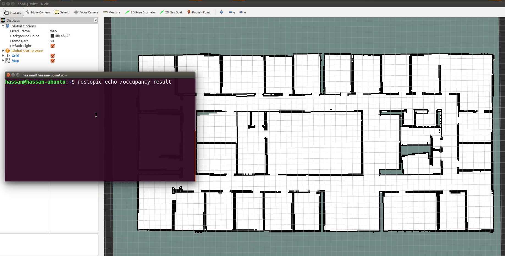

# Solution Project 3

This is the solution for [project 3](https://github.com/mas-group/foundations_course/blob/master/content/ros/nodes_topics_messages/home_work/README.md)


## How to run

- After cloning this repo. and building it, run this launch file:

```bash
roslaunch project_3 all.launch
```

- check result on `/occupancy_result` topic.





